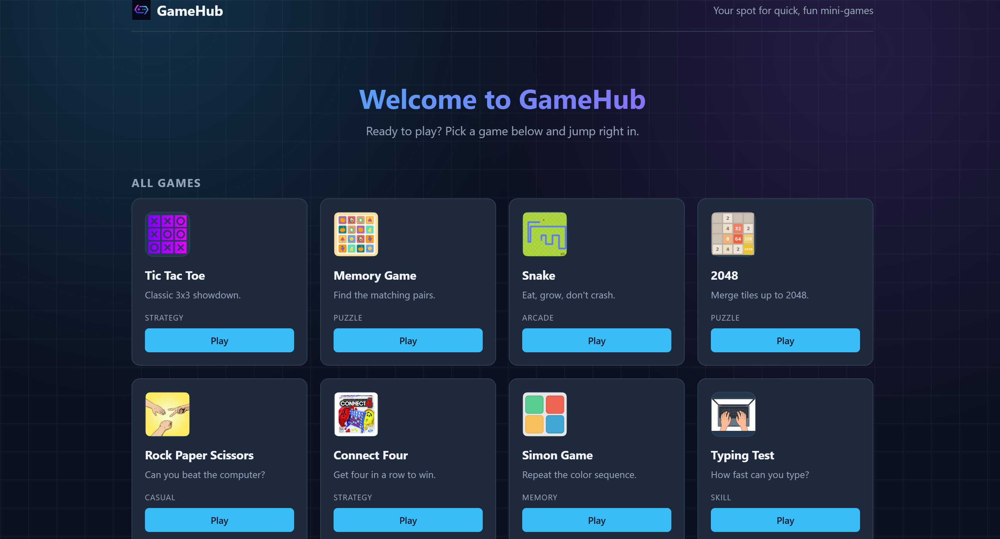

# GameHub

A collection of classic browser games built with React and Vite. Single-page app with a shared design system, persistent high scores, and a responsive layout.

**Live demo:** https://gamehub007-three.vercel.app/



## Games included

| Game | Highlights |
| --- | --- |
| Tic Tac Toe | 2-player, win/draw detection |
| Rock Paper Scissors | Score tracking vs. computer |
| Connect Four | Win detection in 4 directions |
| Memory Game | 3D card flip, move counter |
| Simon | Increasing sequence, best level saved |
| Snake | Arrow keys + WASD, high score saved |
| 2048 | Classic tile palette, best score saved |
| Typing Test | Live per-character highlight, WPM + accuracy |

## Tech stack

- **React** (functional components + hooks)
- **Vite** for dev server and build
- **Plain CSS** with CSS variables for theming (no UI library)
- **localStorage** for persistent high scores
- **Vercel** for hosting

## Project structure

```
src/
  components/      # Navbar, GameCard, shared UI
  games/           # One file per game + games.css design system
  utils/
    scoreStorage.js  # get/set high scores in localStorage
  App.jsx
  main.jsx
  index.css        # CSS variables (colors, radius, spacing)
```

All games share the same header, stats row, buttons, and message banners via `games.css`, so the look stays consistent and dark-mode-friendly.

## Run locally

```bash
git clone https://github.com/<your-username>/gamehub.git
cd gamehub
npm install
npm run dev
```

Open http://localhost:5173.

### Build for production

```bash
npm run build
npm run preview
```

## Deployment

Deployed on Vercel. Any push to `main` triggers a new build.

## What I learned building this

- Designing a small reusable component + CSS-variable system so all games look like one app
- Managing game state cleanly with `useState` / `useEffect` (timers, sequences, async flips)
- Keyboard input handling and game loops (Snake, 2048)
- Persisting per-game high scores in localStorage behind a small utility
- Shipping a multi-page React app with file-based routing and deploying it
